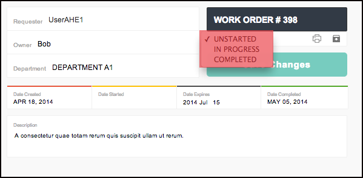
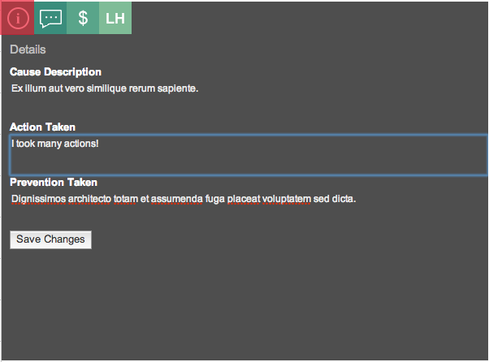
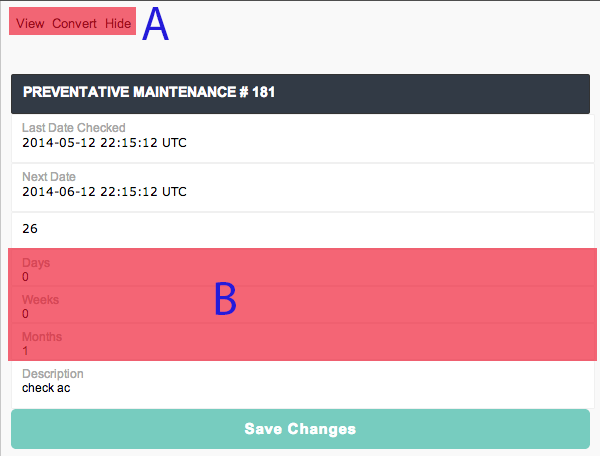
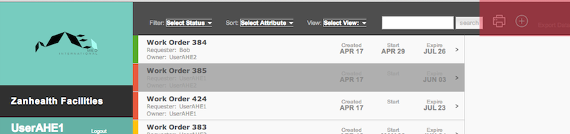
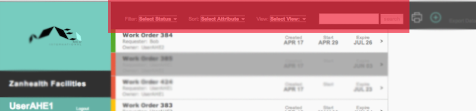
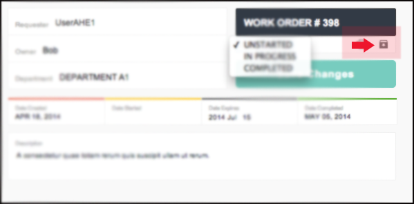
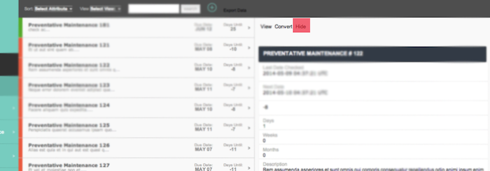
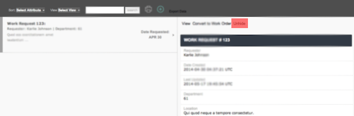

# Zanhealth
---
1. ### [Work Orders](#one)
	*  [A. Work Order List](#1.A)
	*  [B. Work Order Overview](#1.B)
	<!--
		*  [C. Details](#1.C)
		*  [D. Comments](#1.D)
		*  [E. Cost](#1.E)
		*  [F. Labor Hours](#1.F)
	-->
2. ### [Preventative Maintenance](#two)
	*  [Preventative Maintenance Details](#2.B)
3. ### [Work Requests](#three)
4. ### [Dashboard](#four)
	<!--
	*  [A. Statuses](#4.1)
	*  [B. Finances](#4.2)
	*  [C. Labor Hours](#4.3)
	-->
5. ### [Data Input/Output](#five)
6. ### [Managing Views](#six)
	* [A. Search, Filter, and Sort](#6.A)
	* [B. Archive](#6.B)
7. ### [Language](#seven)
---

##  Work Orders
The work order is the basic unit of Zanhealth's function. The work order page is where users can see what repairs need to be made, along with all relevant information for the item and repair. To add a work order, click the "+" button in the upper right corner.

### A. Work Order List

This is a list containing basic information on each work order. By default, work orders are sorted by date, with the soonest date appearing earliest. [(Sort work orders.)](#6.A) Clicking on a work order will open [a more detailed view.](#1.B)

The color tag on the left side indicates status.

*  Green = completed 
*  Yellow = started 
*  Red = not started/expired 

### B. Work Order Overview

Each work order has lots of useful information associated with it. The status, owner, department, expiration date, and description can be toggled upon clicking. The most useful of these will most likely be the status, which can change between "Started", "Unstarted", and "Completed." Saving changes will cause the status in the overview list (i.e. color) to automatically update. 

*Example: changing work request status.*

#### The interfaces of (C), (D), (E), and (F) allow the user to view and edit even more detailed information:

#### C. Details

By clicking , a user can view the details on cause, action, and prevention. These can be easily updated by editing and hitting "Save changes".

*Example: Editing action taken.*

#### D. Comments 

Clicking  will bring up a log of technician comments. New comments can be added by typing in the bottom text box and hitting the ">" button (highlighted in red).

*Example: Adding comment 3 to comments 1 and 2.*
#### E. Cost 

The cost view can be accessed by clicking . You can view and update the cost of a repair by adding the necessary items. 

*Example: Adding the cost of screws to the cost of this repair.*

#### F. Labor Hours 

The total number of hours a repair has been worked on, broken down by technician, can be accessed by clicking . The individual technician, date, and number of hours worked can be edited and saved.

*Example: Adding UserAHE2's 5 hours to the total time of this repair.*

---

##  Preventative Maintenance
Preventative maintenance refers to regularly scheduled maintenance routines that recur at set intervals. The list on the left works in a similar way to the [work order list](#1.A). The preventative maintenance list is sorted by due date, with the maintenance routine with the soonest due date appearing first.

###  Preventative Maintenance Request Details

Clicking on a specific maintenance request will bring up the following interface:

###A. Action Bar

Convert and hide are the most important actions for a work request.

**Convert** converts this preventative maintenance request into a work request, thereby putting it into the work pipeline. That is, if a maintenance request is not converted, it will remain in the preventative maintenance list, but will not show up as a work request. Pressing convert brings up a dialog that prompts the user for information: "Cause Description" must be filled out.

**Hide** [archives](#6.B) this preventative maintenance request.

###B. Set recur time

Toggle the prompts to set how often you want the preventative maintenance request to recur.

---

##  Work Requests

A work request is the precursor to a work order. Work requests must be approved before they are cleared to become work orders. The interface for work requests works almost exactly the same way as [preventative maintenance](#two); again, this can be done with **Convert to Work Order**. 

Work requests can be sorted by either requester or department (both in alphabetical order).

##  Dashboard
The **Dashboard** provides analytics on three crucial logistical areas:

###  Statuses

Make chartz

###  Finances

More chartz

###  Labor Hours

Chartz on chartz on chartz

---

##  Data Input/Output

Data input and output is managed by the gray bar the top of the screen.

####Data Input

The  icon allows a user to create a single instance of the current view (work order, preventative maintenance, or work request).

Soon to come will be an **Import Data* button that allows the user to upload an <code>.csv</code> spreadsheet of equipment.

####Data Output

The **Print** icon allows the user to print a data spreadsheet of the current view. 

The **Export Data** icon offers the same functionality as **Print**, but allows the user to download a <code>.csv</code> version of the spreadsheet. 

---

##  Managing Views

Views can be managed by the gray bar at the top of the screen. 

###  Search, Filter, and Sort 

**Filter** only displays the work requests that fit certain criteria: it can be used to filter work orders by status. **Filter** is unique to the work request menu.

**Sort** orders the work requests by one of the following criteria:

* Date Created
* Date Started
* Requester
* Owner 
* Status

**Search** returns the work requests that have a match with the query string.

###  Archive

Orders and requests in Zanhealth are either **visible** or **hidden**. A hidden request/order is archived; it is either irrelevant, denied, or completed.

A **work order** can be archived by clicking on the archive icon.

**Preventative maintenance requests** and **work requests** can be archived by clicking the hide button in the detailed dialog box.

An archived item can be **unarchived** by performing the same action as hiding. In the case of requests, "unhide" will take the place of "hide".

---

##  Language

Language can be toggled by using the buttons under **Dashboard**. Currently available languages include English, Swahili, and Creole.

---
